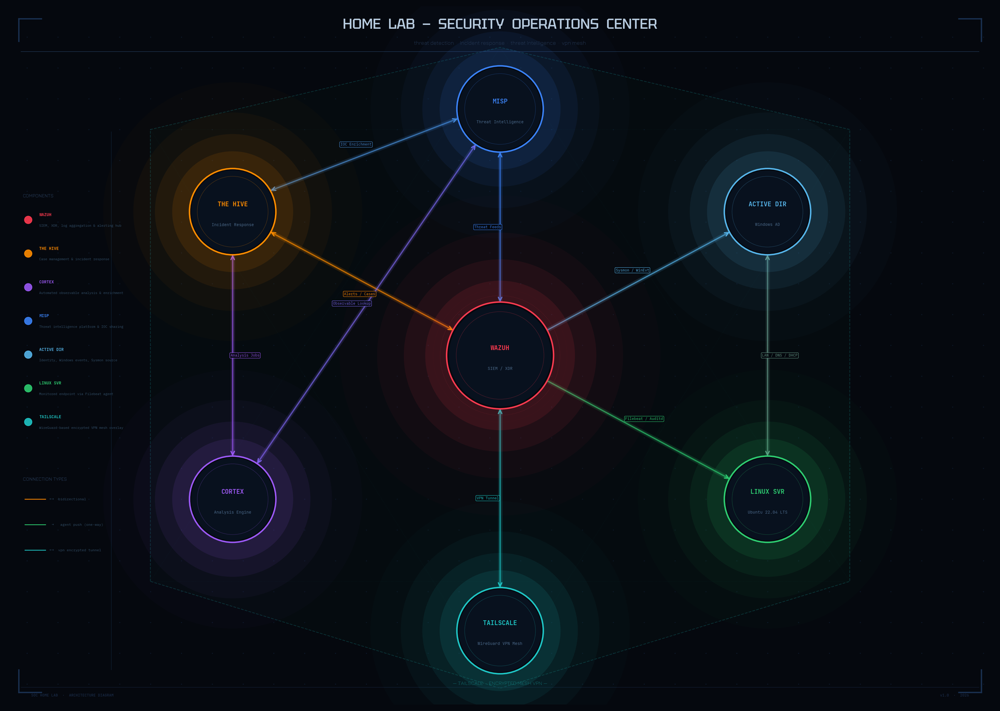

# SOC Multi-Service Logging & Orchestration Lab

## 📌 Project Overview
This repository contains the architecture, research, and configuration files for a self-hosted Security Operations Center (SOC) infrastructure lab. Developed as a collaborative project in a team of three under the technical guidance of Fedi Brinsi for **Securinets FST**, this project focuses on mastering multi-service architectures, systems administration, and data pipeline management from a DevOps and Backend perspective.

Using Docker and virtualization, we designed and deployed an interconnected ecosystem to automate enterprise logging, endpoint telemetry ingestion, and API-driven event orchestration.

---

## 🏗️ System Architecture
The entire infrastructure follows a microservices and virtualized endpoint design pattern to manage data pipelines securely and efficiently:

### Core Components
* **Wazuh (SIEM/XDR):** Acts as the central log aggregation and event processing engine, receiving telemetry from endpoints.
* **MISP (Threat Intelligence):** A self-hosted threat intelligence platform used to store, share, and manage structured Indicators of Compromise (IOCs) and Indicators of Attack (IOAs).
* **TheHive (Case Management):** The centralized alert and incident tracking platform, orchestrating incident lifecycles.
* **Cortex (Analysis Engine):** Integrates directly with TheHive to automate observables analysis and query threat intelligence endpoints via automation scripts.
* **Target Endpoints:** Isolated Windows Server (Active Directory) and Linux Server environments running automated agents to forward system logs securely.

---

## 🚀 Key Technical Implementations (DevOps & Backend Focus)

### 1. Containerized Infrastructure & Networking
* Leveraged **Docker** to deploy and manage a multi-tiered microservices stack (Wazuh, MISP, TheHive, Cortex).
* Implemented custom Docker bridge networks to ensure isolated, secure inter-container communication.
* Managed persistent application states across container lifecycles using defined Docker Volumes.

### 2. Systems Administration & Telemetry Pipelines
* Configured target Linux and Windows Server environments to establish real-time system logging pipelines.
* Managed underlying system daemons (`syslog`, `auth.log`, Windows Event Logs) to stream data reliably to the central aggregation manager.

### 3. API Integration & Automation
* Explored the automation layer connecting separate software applications via **REST APIs** and webhooks.
* Focused on how structured JSON data payloads flow dynamically between systems (e.g., alert generation in Wazuh triggering case management creation inside TheHive).

---

## 📄 Documentation & Research
Detailed breakdowns of the theoretical and architectural decisions made during this project are located in the `docs/` folder:
* [Virtualization vs. Containerization Analysis](docs/virtualization_vs_containerization.md): A comprehensive comparative study on performance, overhead, and architectural isolation between Hypervisors (KVM/QEMU/Proxmox) and OS-level container platforms (Docker).
* [Component Architecture Notes](docs/architecture_notes.md): Notes detailing the setup and roles of each individual microservice.

---

## 👥 Contributors & Acknowledgments
* **Mohamed Nafti** – DevOps & Infrastructure Design
* *Rabeb Dhahri* – Core Implementation
* *Ameni Ben Abdallah* – Technical Research
* Special thanks to **Fedi Brinsi** for technical guidance and **Securinets FST** for providing the platform to execute this lab.
